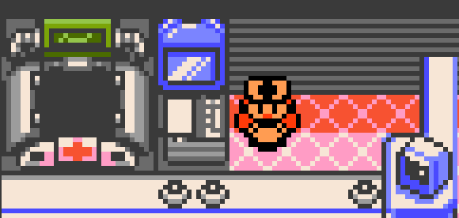

# gen1recomp-fast-pokecenter



Nurse Joy greets you, heals your team, and lets you go — a Gen 2 mod for
[Gen1Recomp](https://github.com/bryanthaboi/gen1recomp).

Requires engine **0.2.x** (developed against 0.2.26).

## What it changes

Vanilla runs six beats for a heal you were always going to accept:

```
"Good morning! Welcome to our POKéMON CENTER."       greeting
"We can heal your POKéMON to perfect health.
 Shall we heal your POKéMON?"          [YES/NO]      prompt
"OK, may I see your POKéMON?"
   … healing animation …
"Thank you for waiting. Your POKéMON are fully healed."
"We hope to see you again."                          + a button press
```

With the mod, that becomes the greeting, the animation, and you're on your way.

| Kept | Cut |
|---|---|
| The greeting, all three time-of-day variants | The prompt preamble |
| The healing animation, jingle and all | The YES/NO — answered for you |
| Pokerus notices | "OK, may I see your POKéMON?" |
| The phone-call registration | "Thank you for waiting." |
| | "We hope to see you again." |
| | Button waits left with nothing to read |

## How it works

The engine's `script.command` hook (`src/script/gen2/Vm.lua`) hands a mod every
opcode of a running script and keeps whatever it returns; returning without
calling `next()` skips that opcode.

**No ROM addresses are hardcoded.** The nurse's entry point comes from the
std-script table *by name* (`PokecenterNurseScript`), and the lines to cut are
derived by walking the script graph at load: of every list the nurse can reach,
exactly one contains the `yesorno`, and that list is the routine body. Its lines
are the routine lines. The greeting lives in the time-of-day branches and the
one-off notices live in their own, so both survive untouched — and the same
reasoning holds on Gold and Silver at their own addresses.

Two details that are less obvious than they look:

- **The routine lines appear twice.** The phone-call branch ends with its own
  "Thank you for waiting" and "We hope to see you again" rows — different tables
  saying the same thing. They are matched by text, not by row, so the copies are
  caught too.
- **Cutting text orphans its button wait.** A `waitbutton` with no text on
  screen is a press of A at an empty box, which is most of what made the counter
  slow. A list whose every line is cut loses its waits as well; the Pokerus
  notice keeps its text, so it keeps its wait.

## Options

In-game under **START → MODS → Fast Pokecenter → OPTIONS..**

| Key | Default | Meaning |
|---|---|---|
| `enabled` | on | master switch |
| `auto_accept` | on | answer the heal prompt for you; off leaves the choice |
| `keep_greeting` | on | off makes the counter completely silent |

## Install

Download `fast_pokecenter-vX.Y.Z.zip` from the
[latest release](https://github.com/aaronjenkins/gen1recomp-fast-pokecenter/releases/latest),
then import it as Gen1Recomp imports any mod: **drag the `.zip` onto the game
window**, or import it from the launcher's mod manager. The engine validates the
archive and installs it to `mods/fast_pokecenter/`.

To install by hand, unzip it into your `mods/` directory (the archive has
`fast_pokecenter/` at its root):
`~/Library/Application Support/pokemon-love2d/mods/` on macOS,
`~/.local/share/pokemon-love2d/mods/` on Linux, `<portable folder>/mods/` for a
portable install.

## Gen 1 is not supported

Red, Blue and Yellow run their Pokémon Center in **engine code**, not as a
script: `OverworldState:nurseHeal` in `src/world/OverworldController.lua`. It
never reaches `script.command`, so there is no hook to wrap. Supporting it would
mean monkey-patching that method behind the `engine_internals` permission and
reimplementing the flow — the follower hop, the music stop, the party heal, the
machine animation, the blackout-map save — by copying engine internals, which
breaks silently the day that function is reworked.

The manifest therefore declares `gen2`, which the engine expands to
gold/silver/crystal.

## Verified behaviour

Every row of the real nurse script graph was driven through the hook and checked
against what still reaches the engine:

```
2f:40af  run   "Good morning! Welcome to our POKéMON CENTER."
2f:40f1  SKIP  "We can heal your POKéMON… Shall we heal your POKéMON?"
2f:40f1  SKIP  yesorno            (auto-answered, scriptVar=1)
2f:40f1  SKIP  "OK, may I see your POKéMON?"
2f:40f1  run   pause/special/turnobject/playmusic   (the animation)
2f:40f1  SKIP  "Thank you for waiting…"
2f:40f1  SKIP  "We hope to see you again."
2f:40f1  SKIP  waitbutton
2f:412f  SKIP  the phone-call branch's duplicate closing lines + its wait
2f:4146  run   "Your POKéMON appear to be infected by tiny life forms."
2f:4155  run   the Pokerus notice's own button wait
```

## Known gaps

- **Not played yet.** Verified opcode-by-opcode against the script graph, but no
  heal has been taken at a real counter.
- **Gen 1 unsupported**, as above.
- **Only the nurse.** The PC, the mart clerk and the bench guy are untouched.

## Development

- `code/fast_pokecenter/` — the mod (`manifest.json`, `main.lua`)
- `install-fastpokecenter/` — installs into the local data dir
- `.github/workflows/release.yml` — tagging `vX.Y.Z` builds and publishes a
  release; it refuses a tag that disagrees with `manifest.json`

## How this was built

Written with [Claude](https://claude.ai) (Claude Code), directed by the
repository owner. The design decisions — keep the greeting, keep the animation,
keep the one-off notices — are the owner's; the Lua and this README were drafted
by the model, and the behaviour above was verified against the running engine
rather than assumed.

## License

[MIT](LICENSE).
